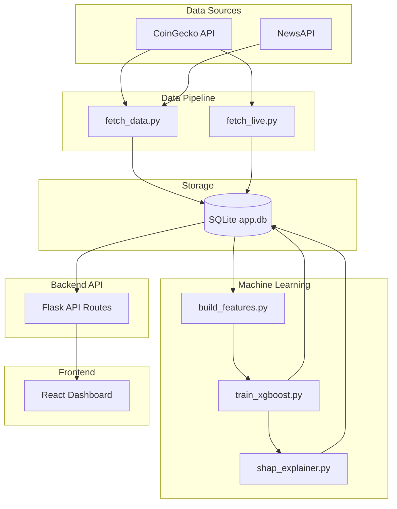

# System Architecture

```mermaid
graph TD
    subgraph Data Sources
        CG[CoinGecko API]
        NAPI[NewsAPI]
    end

    subgraph Data Pipeline
        FD[fetch_data.py]
        FL[fetch_live.py]
    end

    subgraph Storage
        DB[(SQLite app.db)]
    end

    subgraph Machine Learning
        BF[build_features.py]
        TX[train_xgboost.py]
        SE[shap_explainer.py]
    end

    subgraph Backend API
        FA[Flask API Routes]
    end

    subgraph Frontend
        React[React Dashboard]
    end

    CG --> FD
    CG --> FL
    NAPI --> FD

    FD --> DB
    FL --> DB

    DB --> BF
    BF --> TX
    TX --> SE
    SE --> DB
    TX --> DB

    DB --> FA
    FA --> React
```
